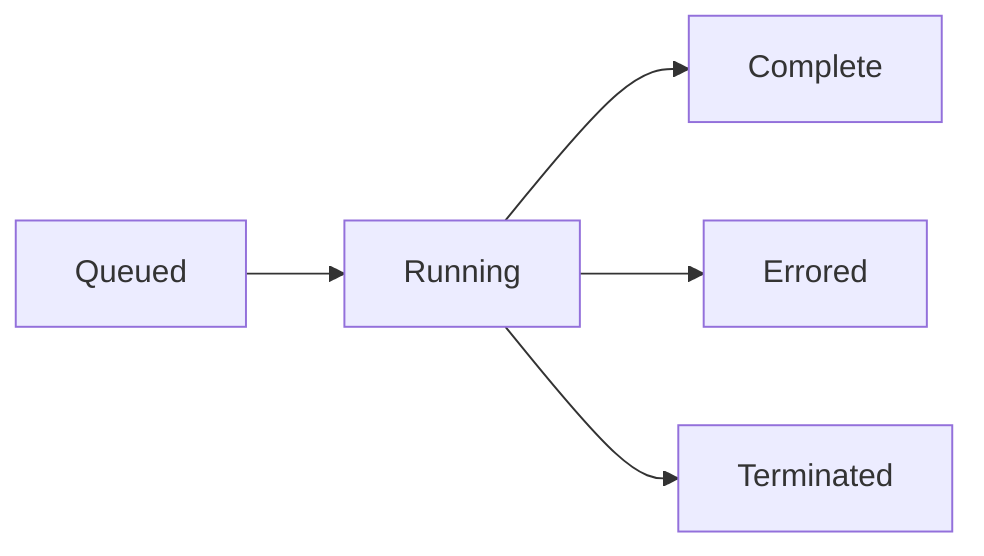

## Overview

Cloudflare Workflows enable you to build reliable, long-running processes that survive Worker restarts, network failures, and errors. Workflows provide automatic retries, state persistence, and event-driven execution.

<Info>
Workflows are built on Durable Objects and provide high-level primitives for steps, retries, sleeps, and event handling.
</Info>

## Core Concepts

### Workflow Instances

Each workflow execution is a separate instance with:
- **Unique ID**: Identifier for tracking and introspection
- **Persistent state**: Survives across executions
- **Status tracking**: Queued, running, complete, errored, terminated
- **Event queue**: Receive external events during execution

### Steps

Steps are the building blocks of workflows. Each step:
- Executes code with automatic retries
- Caches results for idempotency
- Supports custom retry policies
- Has configurable timeouts

### Workflow Lifecycle



## Creating Workflows

### Define Workflow Class

```typescript src/workflow.ts
import { WorkflowEntrypoint, WorkflowStep, WorkflowEvent } from "cloudflare:workers";

type Params = {
  orderId: string;
  userId: string;
};

export class OrderWorkflow extends WorkflowEntrypoint<Env, Params> {
  async run(event: WorkflowEvent<Params>, step: WorkflowStep) {
    const { orderId, userId } = event.payload;
    
    // Step 1: Validate order
    const order = await step.do("validate order", async () => {
      const response = await fetch(`https://api.example.com/orders/${orderId}`);
      return await response.json();
    });
    
    // Step 2: Charge payment
    const payment = await step.do("charge payment", {
      retries: {
        limit: 3,
        delay: 2000,
        backoff: "exponential"
      },
      timeout: "30 seconds"
    }, async () => {
      return await chargeCustomer(userId, order.total);
    });
    
    // Step 3: Wait for fulfillment
    await step.sleep("wait for processing", "5 minutes");
    
    // Step 4: Send confirmation
    await step.do("send confirmation", async () => {
      await sendEmail(userId, "Order confirmed", order);
    });
    
    return { success: true, orderId, payment };
  }
}
```

### Configure Binding

```json wrangler.json
{
  "workflows": [
    {
      "binding": "ORDER_WORKFLOW",
      "name": "order-workflow",
      "class_name": "OrderWorkflow"
    }
  ]
}
```

### Trigger Workflow

```typescript src/index.ts
export default {
  async fetch(request: Request, env: Env) {
    // Create workflow instance
    const instance = await env.ORDER_WORKFLOW.create({
      params: {
        orderId: "order-123",
        userId: "user-456"
      }
    });
    
    return Response.json({
      instanceId: instance.id
    });
  }
}
```

## Workflow Steps

### Basic Steps

Steps automatically cache results and retry on failure:

```typescript
await step.do("fetch data", async () => {
  const response = await fetch("https://api.example.com/data");
  return await response.json();
});
```

### Step Configuration

```typescript
await step.do("critical operation", {
  retries: {
    limit: 5,           // Retry up to 5 times
    delay: 1000,        // Initial delay: 1 second
    backoff: "linear"   // or "exponential"
  },
  timeout: "10 minutes" // Maximum execution time
}, async () => {
  // Your code here
});
```

<ParamField path="retries.limit" type="number" default="5">
  Maximum number of retry attempts (0 to disable retries)
</ParamField>

<ParamField path="retries.delay" type="number" default="1000">
  Initial delay between retries in milliseconds
</ParamField>

<ParamField path="retries.backoff" type="string" default="exponential">
  Retry backoff strategy: `"linear"` or `"exponential"`
</ParamField>

<ParamField path="timeout" type="string" default="10 minutes">
  Maximum step execution time (e.g., `"30 seconds"`, `"5 minutes"`, `"1 hour"`)
</ParamField>

### Retry Behavior

**Exponential backoff:**
- Attempt 1: Immediate
- Attempt 2: 1s delay
- Attempt 3: 2s delay
- Attempt 4: 4s delay
- Attempt 5: 8s delay

**Linear backoff:**
- Attempt 1: Immediate
- Attempt 2: 1s delay
- Attempt 3: 1s delay
- Attempt 4: 1s delay
- Attempt 5: 1s delay

### Non-Retryable Errors

Mark errors as non-retryable to immediately fail the workflow:

```typescript
class NonRetryableError extends Error {
  constructor(message: string) {
    super(message);
    this.name = "NonRetryableError";
  }
}

await step.do("validate input", async () => {
  if (!isValid(input)) {
    throw new NonRetryableError("Invalid input format");
  }
  return processInput(input);
});
```

## Sleep and Timing

### Sleep Duration

Pause workflow execution:

```typescript
// Sleep for fixed duration
await step.sleep("wait 5 minutes", "5 minutes");
await step.sleep("wait 30 seconds", "30 seconds");
await step.sleep("wait 2 hours", "2 hours");

// Sleep with milliseconds
await step.sleep("short wait", 5000); // 5 seconds
```

### Sleep Until Timestamp

Sleep until specific time:

```typescript
// Sleep until specific date
const targetDate = new Date("2024-12-31T23:59:59Z");
await step.sleepUntil("new year", targetDate);

// Sleep until timestamp
const futureTime = Date.now() + (24 * 60 * 60 * 1000); // 24 hours
await step.sleepUntil("tomorrow", futureTime);
```

<Warning>
Sleeping until a past timestamp will throw an error. Always validate timestamps are in the future.
</Warning>

## Event Handling

### Wait for Events

Pause execution until an external event arrives:

```typescript
await step.do("send verification email", async () => {
  await sendEmail(user.email, "verify-email");
});

// Wait up to 24 hours for verification click
const event = await step.waitForEvent<{ verified: boolean }>("email verified", {
  type: "email.verified",
  timeout: "24 hours"
});

if (!event.payload.verified) {
  throw new Error("Email verification timeout");
}
```

### Send Events to Workflow

```typescript
// Get workflow instance
const instance = await env.ORDER_WORKFLOW.get("instance-id");

// Send event to resume workflow
await instance.sendEvent({
  type: "email.verified",
  payload: { verified: true }
});
```

### Event Patterns

**User confirmation:**
```typescript
const confirmation = await step.waitForEvent<{ approved: boolean }>("approval", {
  type: "user.approval",
  timeout: "7 days"
});

if (confirmation.payload.approved) {
  await step.do("process approved request", async () => {
    // Continue workflow
  });
}
```

**Webhook integration:**
```typescript
// Wait for webhook from external service
const webhook = await step.waitForEvent<WebhookPayload>("payment complete", {
  type: "stripe.payment.succeeded",
  timeout: "10 minutes"
});

await step.do("fulfill order", async () => {
  await fulfillOrder(webhook.payload.orderId);
});
```

## Instance Management

### Create Instance

```typescript
// Create with auto-generated ID
const instance = await env.WORKFLOW.create({
  params: { data: "value" }
});

// Create with custom ID (idempotent)
const instance = await env.WORKFLOW.create({
  id: "user-123-onboarding",
  params: { userId: "123" }
});
```

### Get Instance Status

```typescript
const instance = await env.WORKFLOW.get("instance-id");
const status = await instance.status();

console.log(status);
// {
//   status: "running" | "complete" | "errored" | "queued" | "terminated",
//   output: null | any,  // Available when status is "complete"
//   error: null | Error  // Available when status is "errored"
// }
```

### Batch Creation

Create multiple instances at once:

```typescript
const instances = await env.WORKFLOW.createBatch([
  { params: { orderId: "order-1" } },
  { params: { orderId: "order-2" } },
  { params: { orderId: "order-3" } }
]);

console.log(instances);
// [{ id: "..." }, { id: "..." }, { id: "..." }]
```

## Advanced Patterns

### Human-in-the-Loop

```typescript
export class ApprovalWorkflow extends WorkflowEntrypoint {
  async run(event: WorkflowEvent<{ requestId: string }>, step: WorkflowStep) {
    // Submit request
    await step.do("create approval request", async () => {
      await createApprovalRequest(event.payload.requestId);
      await notifyApprovers();
    });
    
    // Wait for approval (max 7 days)
    const approval = await step.waitForEvent<{ approved: boolean }>("approval", {
      type: "approval.decision",
      timeout: "7 days"
    });
    
    if (approval.payload.approved) {
      await step.do("execute approved action", async () => {
        await executeAction();
      });
    } else {
      await step.do("handle rejection", async () => {
        await notifyRejection();
      });
    }
  }
}
```

### Saga Pattern

Compensating transactions for distributed workflows:

```typescript
export class SagaWorkflow extends WorkflowEntrypoint {
  async run(event: WorkflowEvent<OrderParams>, step: WorkflowStep) {
    const compensations: (() => Promise<void>)[] = [];
    
    try {
      // Step 1: Reserve inventory
      await step.do("reserve inventory", async () => {
        await reserveInventory(event.payload.items);
      });
      compensations.push(() => releaseInventory(event.payload.items));
      
      // Step 2: Charge payment
      await step.do("charge payment", async () => {
        await chargePayment(event.payload.total);
      });
      compensations.push(() => refundPayment(event.payload.total));
      
      // Step 3: Ship order
      await step.do("ship order", async () => {
        await shipOrder(event.payload.orderId);
      });
      
      return { success: true };
    } catch (error) {
      // Compensate in reverse order
      for (const compensate of compensations.reverse()) {
        await step.do("compensate", compensate);
      }
      throw error;
    }
  }
}
```

### Scheduled Workflows

Trigger workflows on a schedule:

```typescript src/index.ts
export default {
  async scheduled(event: ScheduledEvent, env: Env) {
    // Run daily report workflow
    await env.REPORT_WORKFLOW.create({
      params: {
        date: new Date().toISOString(),
        type: "daily"
      }
    });
  }
}
```

Configure schedule in `wrangler.json`:
```json
{
  "triggers": {
    "crons": ["0 0 * * *"]  // Daily at midnight
  }
}
```

## Testing

Workflows can be tested using Vitest and Workers testing utilities:

```typescript workflow.test.ts
import { expect, it } from "vitest";
import { env, runInDurableObject } from "cloudflare:test";

it("completes order workflow", async () => {
  const workflow = env.ORDER_WORKFLOW;
  
  const instance = await workflow.create({
    params: {
      orderId: "test-order",
      userId: "test-user"
    }
  });
  
  // Wait for completion
  await new Promise(resolve => setTimeout(resolve, 1000));
  
  const status = await instance.status();
  expect(status.status).toBe("complete");
  expect(status.output.success).toBe(true);
});
```

## Best Practices

<CardGroup cols={2}>
  <Card title="Idempotent Steps" icon="arrows-rotate">
    Design step functions to be safely retryable. Use step names as cache keys for idempotency.
  </Card>
  
  <Card title="Timeout Wisely" icon="clock">
    Set realistic timeouts. Default is 10 minutes, but long-running external calls may need more.
  </Card>
  
  <Card title="Handle Events" icon="bolt">
    Always set timeouts on `waitForEvent` to prevent workflows from waiting indefinitely.
  </Card>
  
  <Card title="State Size" icon="database">
    Keep workflow state small. Large objects in step results consume Durable Object storage.
  </Card>
</CardGroup>

## Limitations

<Warning>
  **Important Constraints**
  
  - Maximum step name length: 64 characters
  - Workflows run in Durable Objects (same limits apply)
  - Step results must be serializable (no functions, classes with methods)
  - Maximum workflow execution time: Limited by Durable Object lifetime
</Warning>

## Error Handling

### Workflow Errors

When a workflow fails:
```typescript
const instance = await env.WORKFLOW.get("instance-id");
const status = await instance.status();

if (status.status === "errored") {
  console.error("Workflow failed:", status.error);
  // Handle error: retry, compensate, or alert
}
```

### Step Failures

Steps automatically retry based on configuration. After exhausting retries, the workflow status becomes "errored".

### Workflow Termination

Manually terminate a stuck workflow:
```typescript
const instance = await env.WORKFLOW.get("instance-id");
await instance.terminate();
```

## Monitoring

Track workflow execution:

```typescript
export class MonitoredWorkflow extends WorkflowEntrypoint {
  async run(event: WorkflowEvent<Params>, step: WorkflowStep) {
    const startTime = Date.now();
    
    await step.do("track start", async () => {
      await env.ANALYTICS.writeDataPoint({
        blobs: ["workflow_started"],
        doubles: [startTime],
        indexes: [event.payload.workflowType]
      });
    });
    
    // Workflow logic
    const result = await performWork(step);
    
    await step.do("track completion", async () => {
      const duration = Date.now() - startTime;
      await env.ANALYTICS.writeDataPoint({
        blobs: ["workflow_completed"],
        doubles: [duration],
        indexes: [event.payload.workflowType]
      });
    });
    
    return result;
  }
}
```
